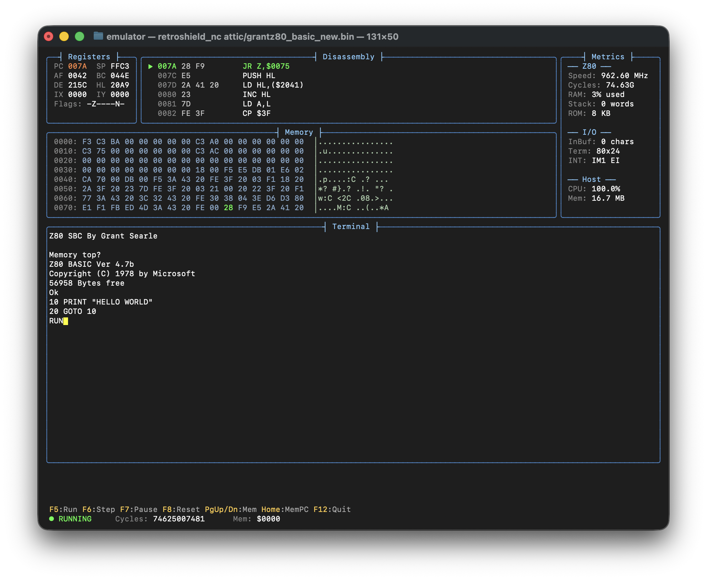

# RetroShield Z80 Emulator

A Z80 emulator for testing [RetroShield Z80](https://www.interlockelectronics.com/retroshield-z80/) firmware on your development machine. Includes both a simple passthrough emulator and a full-featured TUI debugger.

This emulator is designed to run the firmware from the [retroshield-arduino](https://gitlab.com/ajokela/retroshield-arduino) repository.



## Features

- **Cycle-accurate Z80 emulation** using the [superzazu/z80](https://github.com/superzazu/z80) library
- **Dual serial chip emulation:**
  - MC6850 ACIA (ports $80/$81) - used by MINT, Firth, Monty, Retro Pascal
  - Intel 8251 USART (ports $00/$01) - used by Grant's BASIC, EFEX
- **Two emulator modes:**
  - `retroshield` - Simple passthrough (stdin/stdout)
  - `retroshield_nc` - Full TUI debugger with registers, disassembly, memory view (using notcurses)

## Building

### Prerequisites

- C99 compiler (gcc, clang)
- notcurses library (for TUI version)

On macOS:
```bash
brew install notcurses
```

On Debian/Ubuntu:
```bash
sudo apt-get install libnotcurses-dev
```

### Compile

```bash
make              # Build both emulators
make retroshield  # Build passthrough only
make retroshield_nc  # Build TUI only
```

## Usage

### Passthrough Emulator

Simple emulator that connects stdin/stdout directly to the emulated ACIA:

```bash
./retroshield <rom.bin>

# Options:
#   -d          Debug mode (prints load info)
#   -c <cycles> Run for specified cycles then exit
```

Example:
```bash
./retroshield ../firmware/pascal.z80.bin
```

### TUI Debugger

Full-screen debugger with register display, disassembly, memory view, and terminal:

```bash
./retroshield_nc <rom.bin>
```

## TUI Controls

| Key | Action |
|-----|--------|
| **F1** | Show help |
| **F5** | Run continuously |
| **F6** | Step one instruction |
| **F7** | Pause execution |
| **F8** | Reset CPU |
| **F9** | Memory view scroll up |
| **F10** | Memory view scroll down |
| **F12** | Quit |
| **+/-** | Adjust run speed |
| **Other** | Send to emulated terminal |

The TUI starts in **paused** mode. Press **F5** to run or **F6** to step.

## TUI Layout

```
┌─ Registers ──────────┬─ Disassembly ─────────────────────┐
│ PC:0123  SP:2FFF     │  011E: LD A,(HL)                  │
│ AF:0044  AF':0000    │  011F: CP $0A                     │
│ BC:0000  BC':0000    │ >0121: JR NZ,$0130                │
│ DE:1234  DE':0000    │  0123: CALL $0200                 │
│ HL:2100  HL':0000    │  0126: RET                        │
│ IX:0000  IY:0000     │                                   │
│ I:00 R:12  IM:1      └───────────────────────────────────┤
│ Flags: S Z - H - P N C                                   │
│        0 1 0 0 0 1 0 0                                   │
│ Cyc: 12345678                                            │
├─ Memory @ $2100 ─────────────────────────────────────────┤
│ 2100: 48 65 6C 6C 6F 00 00 00  Hello...                  │
│ 2108: 00 00 00 00 00 00 00 00  ........                  │
├─ Terminal ───────────────────────────────────────────────┤
│ Tiny Pascal v0.1                                         │
│ For RetroShield Z80                                      │
│ > 3.14                                                   │
│  = 3.13                                                  │
└──────────────────────────────────────────────────────────┘
[PAUSED] F1:Help F5:Run F6:Step F7:Pause F8:Reset F12:Quit
```

## Memory Map

| Address Range | Size | Description |
|---------------|------|-------------|
| `$0000-$1FFF` | 8KB | ROM (read-only) |
| `$2000-$7FFF` | 24KB | RAM |

## I/O Ports

The emulator provides MC6850 ACIA emulation matching the RetroShield hardware:

| Port | Read | Write |
|------|------|-------|
| `$80` | Status register | Control register |
| `$81` | Receive data | Transmit data |

### Status Register Bits

| Bit | Name | Description |
|-----|------|-------------|
| 0 | RDRF | Receive Data Register Full |
| 1 | TDRE | Transmit Data Register Empty (always 1) |

## Files

```
emulator/
├── retroshield.c      # Passthrough emulator
├── retroshield_nc.c   # TUI debugger (notcurses)
├── z80.c              # Z80 CPU emulation (superzazu/z80)
├── z80.h              # Z80 header
├── z80_disasm.c       # Z80 disassembler
├── z80_disasm.h       # Disassembler header
├── Makefile
├── README.md
└── attic/             # Helper scripts, test files, ROM copies
```

## Examples

### Testing ROMs

```bash
# Run MINT
./retroshield ../kz80_mint/firmware/mint.z80.bin

# Run Firth Forth
./retroshield ../kz80_forth/firmware/firth.z80.bin

# Run Grant's BASIC
./retroshield ../kz80_grantz80/firmware/grantz80_basic.bin

# Debug with TUI
./retroshield_nc ../kz80_pascal/firmware/pascal.z80.bin
```

### Debugging a Crash

1. Run `./retroshield_nc rom.bin`
2. Press **F5** to run until crash/halt
3. Press **F7** to pause
4. Examine registers and disassembly
5. Use **PgUp/PgDn** to browse memory
6. Press **F8** to reset and try again

### Scripted Testing

```bash
# Run with input from file, limit cycles
echo "3.14" | ./retroshield -c 1000000 ../firmware/pascal.z80.bin
```

## License

- **Emulator code**: MIT License
- **Z80 core** (z80.c/z80.h): MIT License, Copyright (c) 2019 Nicolas Allemand
  - Source: https://github.com/superzazu/z80

## See Also

- [RetroShield Z80](https://www.interlockelectronics.com/retroshield-z80/) - Hardware platform by Interlock Electronics
- [retroshield-hw](https://gitlab.com/8bitforce/retroshield-hw) - Original RetroShield hardware design by Erturk Kocalar
- [retroshield-arduino](https://gitlab.com/ajokela/retroshield-arduino) - Canonical Arduino sketches for RetroShield
- [superzazu/z80](https://github.com/superzazu/z80) - Z80 emulation library
